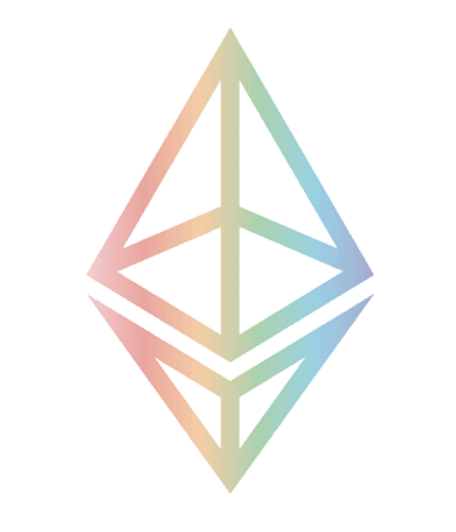
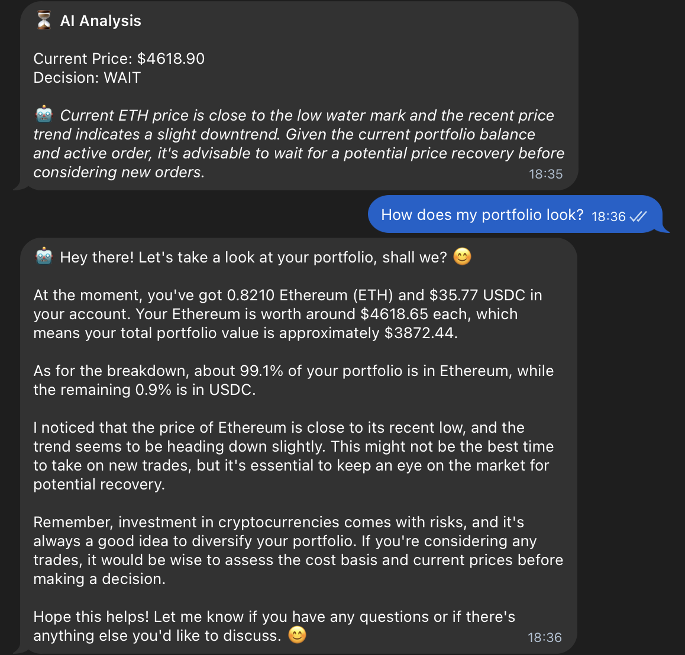

<div align="center">
  
  # Conversational AI Trading Bot
  
  <div align="center">
    
    &nbsp;&nbsp;&nbsp;&nbsp;
    
    &nbsp;&nbsp;&nbsp;&nbsp;
    
  </div>
  
  <br/>
  
  **An intelligent cryptocurrency trading bot with conversational AI that trades on CoW Protocol (Base network)**
  
  [](https://opensource.org/licenses/ISC)
  [](https://nodejs.org/)
  [](https://base.org/)
  
  *Chat with your AI trading assistant via Telegram while it automatically trades WETH/USDC pairs*
  
</div>

## 📸 Bot in Action

<div align="center">
  
  <p><em>Live trading bot monitoring ETH markets and making AI-powered decisions</em></p>
</div>

## 🎯 Key Features

<table>
<tr>
<td width="50%">

### 🧠 **AI-Powered Trading**
- Multiple AI models with fallback
- Market analysis and trend detection  
- Intelligent buy/sell timing
- Reasoning-based decisions

</td>
<td width="50%">

### 💾 **Smart Memory**
- Fetches complete trading history
- **Active order tracking & management**
- FIFO cost basis calculation
- **Designed to prevent selling at a loss**
- Persistent state management

</td>
</tr>
<tr>
<td width="50%">

### 🛡️ **Safety First**
- Hard-coded protection rules
- Position size limits (80% max)
- Balance verification
- Multiple safety layers

</td>
<td width="50%">

### 📱 **Real-time Monitoring**
- Telegram notifications
- **AI-powered Telegram replies**
- Order fill alerts
- Portfolio updates
- Error notifications

</td>
</tr>
</table>

## 🚀 Quick Start

### 📦 Installation
```bash
# Clone the repository
git clone https://github.com/Saga-Labs/ai-trading-bot.git
cd ai-trading-bot

# Install dependencies
npm install
```

### ⚙️ Environment Setup

⚠️ **SECURITY WARNING**: 
- Never commit your `.env` file to version control
- Add `.env` to your `.gitignore` file immediately
- Keep your private keys secure and never share them

Create a `.env` file:
```env
# 🔑 Required Keys
PRIVATE_KEY=your_wallet_private_key_here
BASE_RPC_URL=https://mainnet.base.org
OPENROUTER_API_KEY=sk-or-v1-your_openrouter_key_here

# 📱 Optional (Telegram Notifications)
TELEGRAM_BOT_TOKEN=your_telegram_bot_token
TELEGRAM_CHAT_ID=your_telegram_chat_id

# 🤖 Optional (Custom AI Models)
AI_MODELS=mistralai/mistral-7b-instruct,meta-llama/llama-3.1-8b-instruct
```

### 📱 Telegram Bot Setup
1. **Create Bot**: Message [@BotFather](https://t.me/BotFather) on Telegram
2. **Use Command**: Send `/newbot` and follow instructions
3. **Get Token**: Copy the bot token to `TELEGRAM_BOT_TOKEN`
4. **Get Chat ID**: Message [@userinfobot](https://t.me/userinfobot) to get your chat ID
5. **Test**: Send `/start` to your bot to verify connection

### 💰 Funding Requirements
- **Minimum**: At least $500 USDC + $500 in WETH to start
- **Gas Fees**: Keep extra WETH for transaction fees
- **Testing**: Start with small amounts you can afford to lose completely

### 🎬 Launch
```bash
npm start
```

## 🤖 AI Models

The bot uses OpenRouter API to access various AI models for trading decisions:

| Model | Provider | Speed | Quality |
|-------|----------|-------|---------|
| 🔥 Mistral 7B Instruct | Mistral AI | Fast | Good |
| 🦙 Llama 3.1 8B Instruct | Meta | Medium | Better |

*Configure custom models via the `AI_MODELS` environment variable*

## 🏗️ Architecture

## 📊 How It Works

### 🔄 Trading Cycle (Every 5 Minutes)
```
┌─────────────────┐    ┌─────────────────┐    ┌─────────────────┐
│   Price Check   │───▶│  Fill Detection │───▶│ Portfolio State │
└─────────────────┘    └─────────────────┘    └─────────────────┘
         │                       │                       │
         ▼                       ▼                       ▼
┌─────────────────┐    ┌─────────────────┐    ┌─────────────────┐
│  AI Analysis    │◀───┤ Safety Filters  │◀───┤ Order Execution │
└─────────────────┘    └─────────────────┘    └─────────────────┘
```

### 📊 Decision Matrix

| Condition | AI Recommendation | Safety Check | Action |
|-----------|-------------------|--------------|--------|
| Price > Cost Basis + $50 | SELL | ✅ Pass | Place Sell Order |
| Price < Cost Basis | SELL | ❌ Block | WAIT for Recovery |
| Portfolio 80%+ ETH | SELL | ✅ Pass | Rebalance Sell |
| Good Dip Opportunity | BUY | ✅ Pass | Place Buy Order |

### 🚀 Startup Process
1. **History Analysis**: Fetches your last 50 CoW trades
2. **Cost Basis**: Calculates average purchase price using FIFO
3. **Balance Check**: Compares calculated vs actual wallet balance
4. **AI Initialization**: Tests AI models and sets up decision system

## 🛡️ Safety Mechanisms

<div align="center">

### 🔒 Never Sell at Loss Protection
```javascript
// 🚫 Hard-coded rule - AI cannot override
if (sellPrice < costBasis + MIN_PROFIT_MARGIN) {
  return "WAIT" // 🛑 Refuse to sell
}
```

</div>

| Safety Layer | Description | Override |
|--------------|-------------|----------|
| 🔴 Loss Prevention | Designed to prevent selling below cost basis + $50 | ❌ No |
| ⚖️ Position Limits | Max 80% in one asset | ❌ No |
| 💰 Min Order Size | $100 minimum trades | ❌ No |
| 🔍 Balance Verification | Checks actual vs calculated | ❌ No |
| 🤖 AI Fallback | Mathematical rules if AI fails | ❌ No |

## 📱 Telegram Integration

<div align="center">
  
  <p><em>Real-time trading notifications delivered to your Telegram</em></p>
</div>

### 🤖 NEW: AI Telegram Replies & Commands!
The bot now features **interactive AI responses** and comprehensive command system directly in Telegram! Get intelligent answers about your portfolio, market conditions, and trading decisions.

<div align="center">
  
  <p><em>AI-powered responses and analysis directly in your Telegram chat</em></p>
</div>

#### 📋 Available Telegram Commands

| Command | Description |
|---------|-------------|
| `/start` | Welcome message and current status |
| `/status` | Portfolio overview, cost basis, active orders, AI reasoning |
| `/orders` | Last 10 filled trades with profit/loss analysis |
| `/active` | All current open orders with distance from market price |
| `/history` | Extended trading history and stats (50 orders) |
| `/force` | Manually trigger AI analysis cycle |
| `/help` | Complete command reference |

#### 💬 Conversational AI
Just type regular messages (no slash commands) to chat with the AI about:
- 📈 Market analysis and strategy recommendations
- 💼 Portfolio optimization suggestions  
- 📊 Trade explanations and reasoning
- ⚠️ Risk assessments and safety advice

The conversational AI knows your **exact portfolio**, cost basis, active orders, and recent trading activity for personalized insights!

| Event Type | Notification Example |
|------------|---------------------|
| ✅ Order Filled | `BUY FILLED: 0.125 ETH at $4650 (profit: $150)` |
| 🎯 Order Placed | `SELL Order Placed: 0.1 ETH → $490 at $4900` |
| 📊 Status Update | `Portfolio: 65% ETH, Cost Basis: $4753` |
| ⚠️ Safety Alert | `Blocked sell: Price below cost basis` |
| 🤖 AI Decision | `AI Recommendation: WAIT (confidence: 85%)` |
| 💬 **AI Replies** | `Market analysis: ETH showing bullish momentum...` |

## 🎯 Active Order Management

The bot intelligently tracks and manages your open orders:

### 📊 Order Tracking Features
- **Real-time monitoring** of all active WETH/USDC orders
- **Automatic cancellation** of stale orders too far from market
- **Duplicate prevention** - won't place orders when one exists
- **AI awareness** - includes active orders in decision context

### 🔄 Order Lifecycle
```
┌─────────────────┐    ┌─────────────────┐    ┌─────────────────┐
│   Order Placed  │───▶│  Market Monitor │───▶│ Stale Detection │
└─────────────────┘    └─────────────────┘    └─────────────────┘
         │                       │                       │
         ▼                       ▼                       ▼
┌─────────────────┐    ┌─────────────────┐    ┌─────────────────┐
│   Order Filled  │◀───┤ Price Tracking  │◀───┤ Auto Cancellation│
└─────────────────┘    └─────────────────┘    └─────────────────┘
```

**Example**: `SELL at $4850.00 (231 from market)` → Auto-cancelled as too far from current price

## 📈 How Trading Decisions Work

The bot follows a simple but effective decision process:

1. **Fetch current ETH price** from multiple sources
2. **Calculate portfolio balance** (ETH vs USDC percentage)  
3. **Check cost basis** from your trading history
4. **AI analyzes** market conditions and portfolio state
5. **Safety filters** prevent unprofitable trades
6. **Execute orders** on CoW Protocol if conditions are met

**Key Rules:**
- ✅ Designed to only sell if price > cost basis + $50 minimum profit
- ✅ Maintain balanced portfolio (max 80% in one asset)
- ✅ Minimum $100 order sizes to avoid dust trades

## ✅ Is It Working? - Health Check

Verify your bot is running correctly:

- [ ] Console shows price updates every 5 minutes
- [ ] Telegram notifications arrive successfully  
- [ ] Bot responds to `/status` command
- [ ] No error messages in logs
- [ ] Orders appear in CoW Protocol interface

## 📊 Performance Expectations

**Realistic Trading Behavior:**
- **Frequency**: Bot may wait days between trades for optimal conditions
- **Execution**: CoW Protocol uses batch auctions (not instant fills)
- **Profit Margins**: Typically $50-200 per successful trade
- **Success Rate**: Not all orders will fill due to market conditions

## 🚨 Troubleshooting

### Common Issues

| Problem | Cause | Solution |
|---------|-------|----------|
| No price updates | API connection failed | Check internet connection, restart bot |
| Telegram not working | Wrong bot token/chat ID | Verify setup with @BotFather |
| Orders not filling | Price too far from market | Bot will auto-cancel stale orders |
| AI errors | OpenRouter API issues | Bot falls back to mathematical rules |
| Network errors | RPC connection problems | Check BASE_RPC_URL configuration |

### When Things Go Wrong
- **OpenRouter API Fails**: Bot uses fallback mathematical decision rules
- **CoW Protocol Delays**: Orders may take 5-30 minutes to settle
- **Network Issues**: Bot will retry connections automatically
- **Telegram Errors**: Notifications may be delayed but trading continues

## 🔧 Configuration

### Trading Parameters
```javascript
MIN_PROFIT_MARGIN: 50,      // $50 minimum profit per trade
MAX_POSITION_PERCENT: 0.8,  // Max 80% in one asset  
MIN_ORDER_SIZE: 100,        // $100 minimum order
ORDER_VALIDITY_HOURS: 24,   // 24 hour order expiry
CHECK_INTERVAL: 5 * 60 * 1000, // 5 minute cycles
```

### AI Settings
- Temperature: 0.3 (conservative decisions)
- Max tokens: 500 (concise responses)
- Timeout: 15 seconds per request
- Automatic model rotation on failure

## 🚨 Important Requirements

### Technical Requirements
- Base network wallet with WETH/USDC
- OpenRouter account with API credits ($5+ recommended)
- Node.js 18+ with ES modules support
- Stable internet connection

### Financial Requirements  
- **Minimum Portfolio**: $1000+ ($500 USDC + $500 WETH)
- **Gas Reserves**: Extra WETH for transaction fees
- **Risk Capital**: Only use funds you can afford to lose completely

## ⚠️ IMPORTANT DISCLAIMERS

🚨 **READ BEFORE USING**:

- **Experimental Software**: This bot can lose money due to bugs, AI errors, or market conditions
- **No Guarantees**: No guarantee of profits or complete loss prevention
- **Your Responsibility**: You are responsible for all trades executed by this bot
- **Not Financial Advice**: This is educational software, not professional trading advice
- **Start Small**: Begin with minimal amounts to test functionality
- **Market Risks**: Cryptocurrency trading involves substantial risk of loss
- **Technical Risks**: Smart contracts, APIs, and AI models can fail unexpectedly

### Known Limitations
- Uses limit orders (no guaranteed execution)
- AI models can make incorrect decisions despite safety filters
- CoW Protocol settlement can take 5-30 minutes
- Network congestion may delay or prevent trades
- Bot may miss opportunities during downtime

## 📁 Generated Files

- `ai-bot-state.json` - Bot state and cost basis
- `ai-enhanced-cow-trading-bot.log` - Detailed execution logs  

## 🤝 Support & Monitoring

### Daily Monitoring Recommended
- Check console logs for errors
- Verify Telegram notifications are working
- Monitor actual vs expected portfolio balance
- Review filled orders for accuracy

### Getting Help
The bot includes comprehensive logging and error handling. Check:
1. Console output for real-time status
2. Telegram notifications for alerts
3. Log files for detailed execution history
4. GitHub issues for known problems

---

**⚠️ FINAL WARNING**: This is experimental trading software. Cryptocurrency markets are highly volatile and unpredictable. You could lose all invested funds. Only use money you can afford to lose completely. The developers are not responsible for any financial losses.
