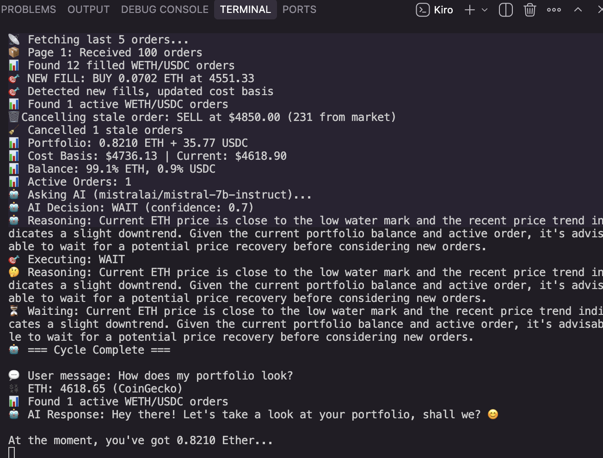
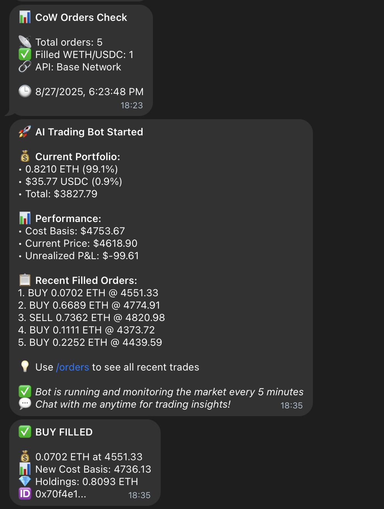

<div align="center">
  
  
  # AI-Enhanced CoW Trading Bot
  
  **An intelligent cryptocurrency trading bot that uses AI to make trading decisions on CoW Protocol (Base network)**
  
  [](https://opensource.org/licenses/ISC)
  [](https://nodejs.org/)
  [](https://base.org/)
  
  *Automatically trades WETH/USDC pairs while protecting your capital with built-in safety mechanisms*
  
</div>

## 📸 Bot in Action

<div align="center">
  
  <p><em>Live trading bot monitoring ETH markets and making AI-powered decisions</em></p>
</div>

## 🎯 Key Features

### 🧠 **AI-Powered Decision Making**
- Uses OpenRouter API with multiple AI models (Mistral, Llama, etc.)
- Analyzes market conditions, portfolio balance, and price trends
- Makes intelligent buy/sell decisions with reasoning
- Automatic fallback to mathematical rules if AI fails

### 💾 **Smart Memory System**
- Fetches your trading history on startup
- Calculates precise cost basis using FIFO accounting
- **Never sells at a loss** - protects your capital
- Remembers your cost basis between restarts

### 🛡️ **Built-in Safety Features**
- Hard-coded safety rules that AI cannot override
- Never sells below cost basis + minimum profit ($50)
- Position limits (max 80% in one asset)
- Minimum order size enforcement
- Balance mismatch detection and correction

### 📱 **Telegram Integration**
- Real-time notifications for all trading activities
- Order placement and fill confirmations
- Portfolio updates and profit tracking
- Error alerts and bot status updates

### ⚡ **Dynamic Trading Logic**
- Tracks price high/low water marks for optimal entry/exit
- Portfolio rebalancing when heavily weighted
- Market trend analysis and volatility adjustment
- 5-minute price monitoring cycle

## 🚀 Quick Start

### 1. Prerequisites
```bash
npm install ethers node-fetch dotenv
```

### 2. Environment Setup
Create a `.env` file:
```env
# Required
PRIVATE_KEY=your_wallet_private_key
BASE_RPC_URL=https://mainnet.base.org
OPENROUTER_API_KEY=sk-or-v1-your_openrouter_key

# Optional (for notifications)
TELEGRAM_BOT_TOKEN=your_telegram_bot_token
TELEGRAM_CHAT_ID=your_telegram_chat_id

# Optional (custom AI models)
AI_MODELS=mistralai/mistral-7b-instruct,meta-llama/llama-3.1-8b-instruct
```

### 3. Run the Bot
```bash
node AITradingBot.js
```

## 🤖 AI Models

### Default Models (Free)
- `mistralai/mistral-7b-instruct` - Primary model
- `meta-llama/llama-3.1-8b-instruct` - Backup
- `microsoft/DialoGPT-medium` - Fallback

### Recommended Premium Models
```env
# Best performance
AI_MODELS=anthropic/claude-3-haiku,openai/gpt-4o-mini,mistralai/mistral-7b-instruct

# Top tier (expensive)
AI_MODELS=anthropic/claude-3-sonnet,openai/gpt-4o,anthropic/claude-3-haiku
```

## 🏗️ Architecture

<div align="center">
  
  <p><em>Complete system architecture showing AI decision flow and safety mechanisms</em></p>
</div>

## 📊 How It Works

### Startup Process
1. **History Analysis**: Fetches your last 50 CoW trades
2. **Cost Basis**: Calculates average purchase price using FIFO
3. **Balance Check**: Compares calculated vs actual wallet balance
4. **AI Initialization**: Tests AI models and sets up decision system

### Trading Cycle (Every 5 Minutes)
1. **Price Update**: Fetches current ETH price from multiple sources
2. **Fill Detection**: Checks for newly filled orders
3. **Portfolio Analysis**: Gets current WETH/USDC balances
4. **AI Decision**: Sends context to AI for trading recommendation
5. **Safety Filter**: Applies hard-coded safety rules
6. **Execution**: Places orders or waits based on filtered decision

### Decision Logic
- **SELL**: Only when price > cost basis + profit margin
- **BUY**: When portfolio heavily USDC weighted or good dip opportunity  
- **WAIT**: When conditions not favorable or AI recommends patience
- **CANCEL**: Removes stale or poorly positioned orders

## 🛡️ Safety Mechanisms

### Never Sell at Loss
```javascript
// Hard-coded rule - AI cannot override
if (sellPrice < costBasis + MIN_PROFIT_MARGIN) {
  return "WAIT" // Refuse to sell
}
```

### Position Limits
- Maximum 80% in either WETH or USDC
- Minimum order size: $100
- Balance mismatch detection and correction

### AI Fallback
- If all AI models fail → uses mathematical rules
- Multiple model redundancy prevents single points of failure
- Confidence scoring for AI recommendations

## 📱 Telegram Integration

<div align="center">
  
  <p><em>Real-time trading notifications delivered to your Telegram</em></p>
</div>

The bot automatically sends notifications for:
- ✅ **Order Filled**: "BUY FILLED: 0.125 ETH at $4650 (profit: $150)"
- 🎯 **Order Placed**: "SELL Order Placed: 0.1 ETH at $4900"  
- 📊 **Bot Status**: Portfolio updates and cost basis changes
- ⚠️ **Alerts**: Errors, safety triggers, balance mismatches

## 📈 Example Scenarios

### Scenario 1: Profitable Market
- Cost basis: $4,500, Current price: $4,700
- AI Decision: SELL (price above cost basis + profit)
- Safety check: ✅ Approved  
- Action: Place sell order at $4,750

### Scenario 2: Underwater Position  
- Cost basis: $4,800, Current price: $4,600
- AI Decision: SELL (rebalance heavy ETH position)
- Safety check: ❌ Blocked (below cost basis)
- Action: WAIT for price recovery

### Scenario 3: Good Buy Opportunity
- Portfolio: 20% ETH, 80% USDC, Price dipped to $4,400
- AI Decision: BUY (good entry point)
- Safety check: ✅ Approved
- Action: Place buy order at $4,350

## 🔧 Configuration

### Trading Parameters
```javascript
MIN_PROFIT_MARGIN: 50,      // $50 minimum profit per trade
MAX_POSITION_PERCENT: 0.8,  // Max 80% in one asset  
MIN_ORDER_SIZE: 100,        // $100 minimum order
ORDER_VALIDITY_HOURS: 24,   // 24 hour order expiry
CHECK_INTERVAL: 5 * 60 * 1000, // 5 minute cycles
```

### AI Settings
- Temperature: 0.3 (conservative decisions)
- Max tokens: 500 (concise responses)
- Timeout: 15 seconds per request
- Automatic model rotation on failure

## 🚨 Important Notes

### Requirements
- Base network wallet with WETH/USDC
- OpenRouter account with API credits
- Node.js 18+ with ES modules support

### Risks
- Uses limit orders (no guaranteed execution)
- AI models can make mistakes (safety filters help)
- CoW Protocol settlement delays
- Market volatility can cause losses

### Best Practices
- Start with small amounts to test
- Monitor Telegram notifications
- Keep some ETH for gas fees
- Regularly check bot logs for issues

## 📁 Generated Files

- `ai-bot-state.json` - Bot state and cost basis
- `ai-enhanced-cow-trading-bot.log` - Detailed execution logs  

## 🤝 Support

The bot includes comprehensive logging and error handling. Check the console output and Telegram notifications for troubleshooting information.

---

**⚠️ Disclaimer**: This bot is for educational purposes. Cryptocurrency trading involves risk. Never trade with funds you cannot afford to lose.
